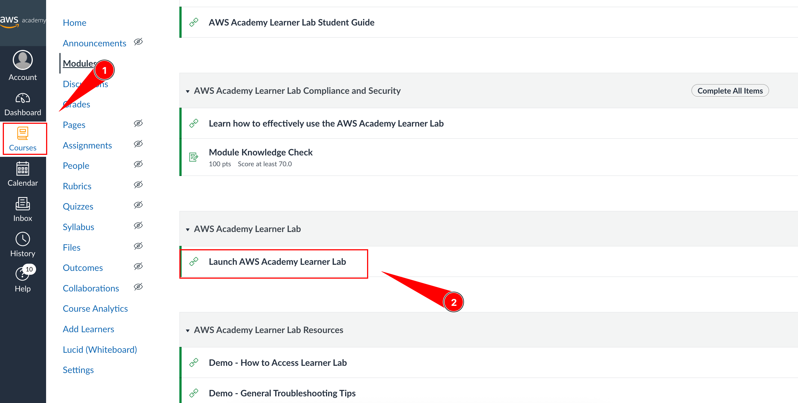
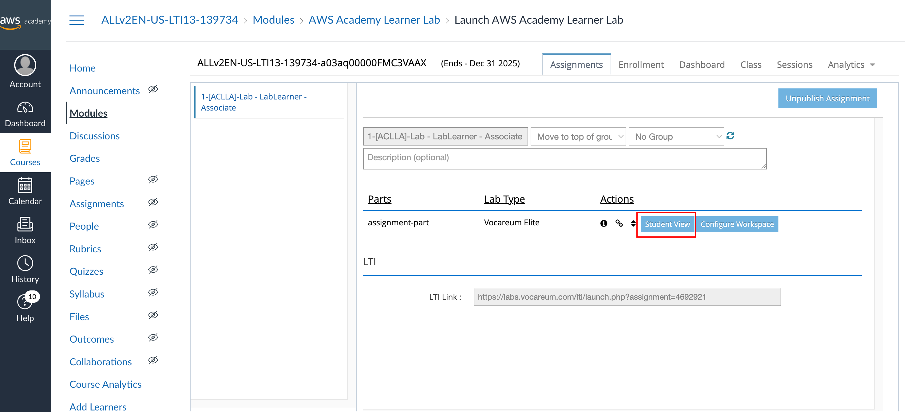
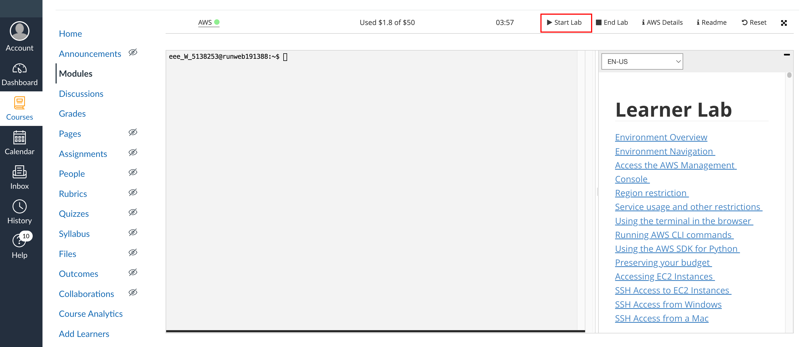

# Lesson 1: DevOps Overview & Course Structure
## Practice Lab Exercises

- Instructor provide AWS lab environemt, guide student how to use it



- Create EC2
- Guide student install visual studios code, install Remote SSH plugin and connect to EC2 instance
    - 
    - download pem file and change permission of pem file `chmod 600 labsuser.pem`
    - Add this to the ssh config
    - ```
        Host aws-lab
        HostName 18.212.231.113 (relace this with ip)
        User ubuntu
        IdentityFile ~/labsuser.pem
        ```

    - ssh to the machine using VS code remote ssh
