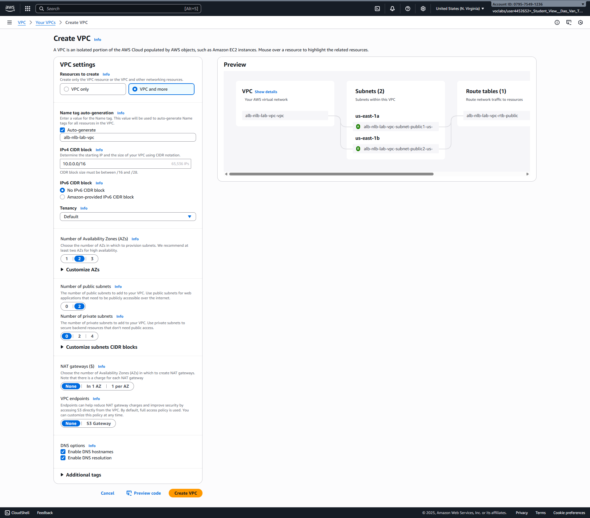
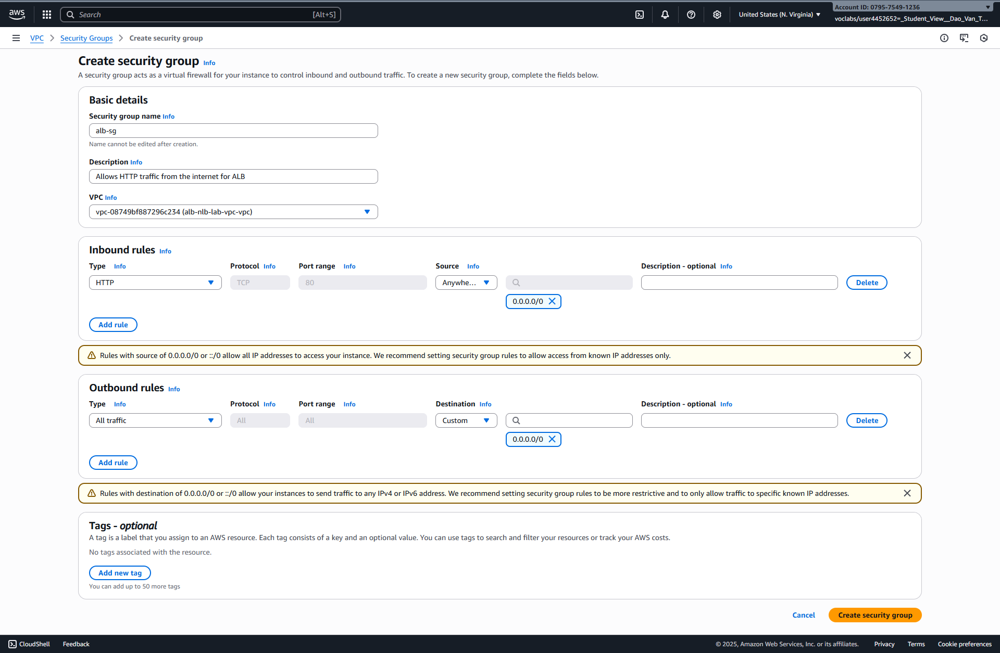
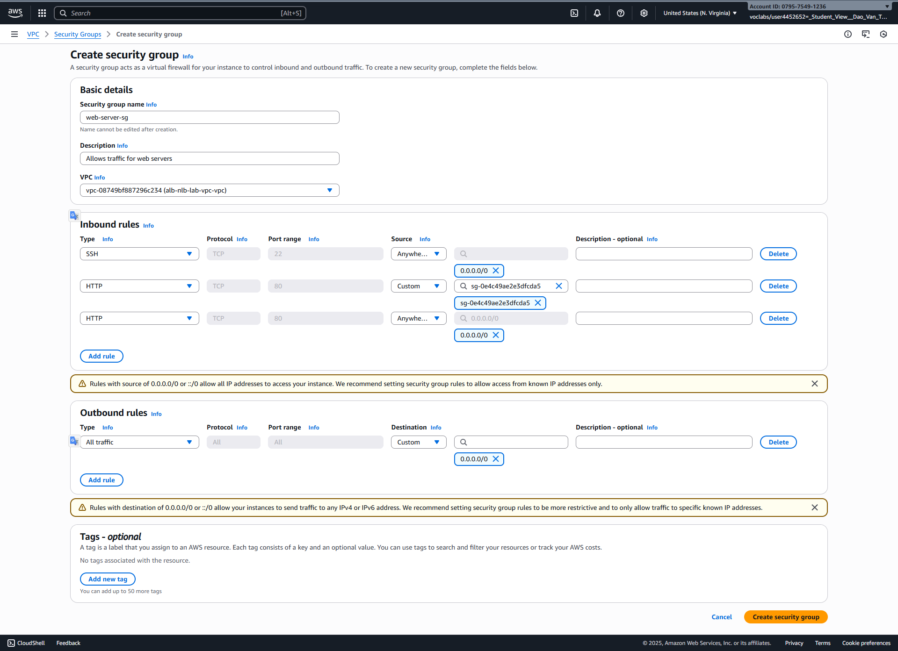

# Lesson 10: AWS Infrastructure & Networking - Practice Lab

# AWS Load Balancer Lab: ALB vs. NLB

This guide provides a detailed, step-by-step walkthrough for creating both an Application Load Balancer (ALB) and a Network Load Balancer (NLB) in AWS, pointing to the same set of backend web servers.

## ❓ Quick Comparison: ALB vs. NLB

Before you build, it's crucial to know *what* you're building and *why*.

| Feature | **Application Load Balancer (ALB)** | **Network Load Balancer (NLB)** |
| :--- | :--- | :--- |
| **OSI Layer** | **Layer 7** (Application) | **Layer 4** (Transport) |
| **Inspects...** | HTTP/HTTPS headers, paths, hostnames | TCP/UDP port and IP address |
| **Protocols** | `HTTP`, `HTTPS` | `TCP`, `UDP`, `TLS` |
| **Best For...** | Web applications, microservices | Ultra-high performance, gaming, streaming, non-HTTP traffic |
| **Key Feature** | **Advanced Routing** (e.g., send `/api` traffic to one server and `/images` to another) | **Extreme Speed & Static IP** (Can provide a static IP per AZ) |


---

## 🎯 Lab Objective

To build a high-availability web application by:
1.  Creating a custom network (VPC).
2.  Launching two web servers in different data centers (Availability Zones).
3.  Deploying an **Application Load Balancer (ALB)** to distribute traffic intelligently.
4.  Deploying a **Network Load Balancer (NLB)** to distribute traffic at high speed.
5.  Testing both load balancers to see how they work.

---

## Step 1: Create Your Network (VPC)

This step is identical for both labs. We'll build the private, isolated network for our resources.

1.  Navigate to the **VPC** service in the AWS Console.
2.  Click the **"Create VPC"** button.
3.  On the creation page, select **"VPC and more"**.
4.  **Name:** `alb-nlb-lab-vpc`
5.  **IPv4 CIDR block:** `10.0.0.0/16`
6.  **Number of Availability Zones (AZs):** Select **2**.
7.  **Number of public subnets:** Select **2**.
8.  **Number of private subnets:** Select **0**.
9.  **NAT gateways:** Select **None**.
10. Click **"Create VPC"**.


AWS will create your VPC, two public subnets (one in each AZ), an Internet Gateway, and a public route table.

---

## Step 2: Create Security Groups (Firewalls)

This is a **critical** step with a key difference between the two labs.

* The **ALB** uses its *own* security group. We will tell the servers to trust the ALB's group.
* The **NLB** does *not* have a security group. It passes the client's IP directly to the server. Therefore, the server's security group must allow traffic from the entire internet.

### A. Create the ALB Security Group

1.  In the **VPC** console, go to **Security > Security Groups** on the left menu.
2.  Click **"Create security group"**.
3.  **Name:** `alb-sg`
4.  **Description:** `Allows HTTP traffic from the internet for ALB`
5.  **VPC:** Select your `alb-nlb-lab-vpc` from the dropdown.
6.  In the **"Inbound rules"** section, click **"Add rule"**:
    * **Type:** `HTTP`
    * **Source:** `Anywhere-IPv4` (`0.0.0.0/0`)
7.  Click **"Create security group"**.

### B. Create the Web Server Security Group

1.  Click **"Create security group"** again.
2.  **Name:** `web-server-sg`
3.  **Description:** `Allows traffic for web servers`
4.  **VPC:** Select your `alb-nlb-lab-vpc`.
5.  In the **"Inbound rules"** section, add the following rules:
    * **Rule 1 (SSH):**
        * **Type:** `SSH`
        * **Source:** `Anywhere-IPv4` (`0.0.0.0/0`)
    * **Rule 2 (for ALB):**
        * **Type:** `HTTP`
        * **Source:** In the search box, type `alb-sg` and select the group you just created.
    * **Rule 3 (for NLB):**
        * **Type:** `HTTP`
        * **Source:** `Anywhere-IPv4` (`0.0.0.0/0`). This is required because the NLB forwards the *original user's IP*, not its own.
6.  Click **"Create security group"**.

---

## Step 3: Launch Your Web Servers (EC2 Instances)

This step is identical for both labs. We are creating the "backend" targets.

1.  Navigate to the **EC2** service in the AWS Console.
2.  Click **"Launch instances"**.

### 🚀 Launch Server 1 (in AZ "a")

1.  **Name:** `web-server-1`
2.  **AMI (Ubuntu Server):**.
3.  **Instance type:** `t3.micro` (Free Tier eligible).
4.  **Key pair:** Select an existing key pair or create a new one.
5.  **Network settings:**
    * Click **"Edit"**.
    * **VPC:** Choose your `alb-nlb-lab-vpc`.
    * **Subnet:** Choose the public subnet that ends in **`us-east-1a`** (or your region's "a" zone).
    * **Auto-assign public IP:** Select **Enable**.
    * **Firewall (security groups):** Select **"Select existing security group"** and choose your `web-server-sg`.
6.  **Advanced details (scroll down):**
    * Find the **"User data"** box and paste the following script.

```bash
#!/bin/bash
# Install docker
apt-get update
apt-get install -y apt-transport-https ca-certificates curl software-properties-common
curl -fsSL https://download.docker.com/linux/ubuntu/gpg | sudo apt-key add -
add-apt-repository \
"deb [arch=amd64] https://download.docker.com/linux/ubuntu \
$(lsb_release -cs) \
stable"
apt-get update
apt-get install -y docker-ce
usermod -aG docker ubuntu

# Install docker-compose
curl -L https://github.com/docker/compose/releases/download/1.21.0/docker-compose-$(uname -s)-$(uname -m) -o /usr/local/bin/docker-compose
chmod +x /usr/local/bin/docker-compose

# Manually add user to docker group
sudo usermod -aG docker $USER

docker run -it -d -p 80:80 --name iamfoo traefik/whoami 
```

7.  Click **"Launch instance"**.

### 🚀 Launch Server 2 (in AZ "b")

1.  Go back to the EC2 Instances list. Select `web-server-1`, click **"Actions" > "Image and templates" > "Launch more like this"**.
2.  **Name:** `web-server-2`
3.  **Network settings:**
    * Click **"Edit"**.
    * **Subnet:** Change this to the *other* public subnet, the one ending in **`us-east-1b`**.
4.  **Advanced details:**
    * Scroll down to **"User data"** and change the text to `Server 2 in AZ-b`:

```bash
#!/bin/bash
# Install docker
apt-get update
apt-get install -y apt-transport-https ca-certificates curl software-properties-common
curl -fsSL https://download.docker.com/linux/ubuntu/gpg | sudo apt-key add -
add-apt-repository \
"deb [arch=amd64] https://download.docker.com/linux/ubuntu \
$(lsb_release -cs) \
stable"
apt-get update
apt-get install -y docker-ce
usermod -aG docker ubuntu

# Install docker-compose
curl -L https://github.com/docker/compose/releases/download/1.21.0/docker-compose-$(uname -s)-$(uname -m) -o /usr/local/bin/docker-compose
chmod +x /usr/local/bin/docker-compose

# Manually add user to docker group
sudo usermod -aG docker $USER

docker run -it -d -p 80:80 --name iamfoo traefik/whoami 
```

5.  Click **"Launch instance"**.

> **Wait!** Before proceeding, wait about 2-3 minutes for your instances to launch and show a "Running" state.

---

## Step 4 (Option A): Create the Application Load Balancer

Follow these steps to create the Layer 7 ALB.

### 4a-1: Create the ALB Target Group

1.  In the **EC2** console, scroll down the left menu to **Load Balancing > Target Groups**.
2.  Click **"Create target group"**.
3.  **Choose a target type:** Select **Instances**.
4.  **Target group name:** `alb-http-targets`
5.  **Protocol / Port:** `HTTP` / `80`
6.  **VPC:** Select your `alb-nlb-lab-vpc`.
7.  **Health checks:**
    * **Protocol:** `HTTP`
    * **Path:** `/`
8.  Click **"Next"**.
9.  **Register targets:** Check the box for **both** `web-server-1` and `web-server-2`.
10. Click **"Include as pending below"**.
11. Click **"Create target group"**.

### 4a-2: Create the ALB

1.  In the **EC2** console, go to **Load Balancing > Load Balancers**.
2.  Click **"Create Load Balancer"**.
3.  Find **"Application Load Balancer"** and click **"Create"**.
4.  **Load balancer name:** `my-alb`
5.  **Scheme:** `Internet-facing`
6.  **Network mapping:**
    * **VPC:** Select your `alb-nlb-lab-vpc`.
    * **Mappings:** Check the box for **both** Availability Zones (e.g., `us-east-1a` and `us-east-1b`) and select the public subnet for each.
7.  **Security groups:**
    * *Remove* the "default" security group.
    * *Add* your `alb-sg`.
8.  **Listeners and routing:**
    * The listener should be `HTTP` on port `80`.
    * In the **"Default action"** column, select your `alb-http-targets` group.
9.  Click **"Create load balancer"**.

---

## Step 4 (Option B): Create the Network Load Balancer

Follow these steps to create the Layer 4 NLB.

### 4b-1: Create the NLB Target Group

1.  In the **EC2** console, go to **Load Balancing > Target Groups**.
2.  Click **"Create target group"**.
3.  **Choose a target type:** Select **Instances**.
4.  **Target group name:** `nlb-tcp-targets`
5.  **Protocol / Port:** `TCP` / `80` (This is the key difference!)
6.  **VPC:** Select your `alb-nlb-lab-vpc`.
7.  **Health checks:**
    * **Protocol:** `TCP` (It will just check if the port is open)
8.  Click **"Next"**.
9.  **Register targets:** Check the box for **both** `web-server-1` and `web-server-2`.
10. Click **"Include as pending below"**.
11. Click **"Create target group"**.

### 4b-2: Create the NLB

1.  In the **EC2** console, go to **Load Balancing > Load Balancers**.
2.  Click **"Create Load Balancer"**.
3.  Find **"Network Load Balancer"** and click **"Create"**.
4.  **Load balancer name:** `my-nlb`
5.  **Scheme:** `Internet-facing`
6.  **Network mapping:**
    * **VPC:** Select your `alb-nlb-lab-vpc`.
    * **Mappings:** Check the box for **both** Availability Zones and select the public subnet for each.
7.  **Security groups:** (Notice you cannot select one! This is by design.)
8.  **Listeners and routing:**
    * The listener should be `TCP` on port `80`.
    * In the **"Default action"** column, select your `nlb-tcp-targets` group.
9.  Click **"Create load balancer"**.

---

## Step 5: Test Your Lab!

1.  **Wait:** Go to the **Load Balancers** list. Your new load balancers will have a state of "Provisioning". Wait 3-5 minutes for this to change to **"Active"**.
2.  **Check Health:** Go to **Target Groups**.
    * Click `alb-http-targets`, then the **"Targets"** tab. The status should become `healthy`.
    * Click `nlb-tcp-targets`, then the **"Targets"** tab. The status should also become `healthy`.
3.  **Get DNS Names:** Go to the **Load Balancers** list.
    * Select `my-alb` and copy its **DNS name**.
    * Select `my-nlb` and copy its **DNS name**.
4.  **Test in Browser:**
    * Paste the **ALB's DNS name** into your browser. Refresh several times. You will see "Hello from Server 1..." and "Hello from Server 2...".
    * Paste the **NLB's DNS name** into your browser. Refresh several times. You will also see "Hello from Server 1..." and "Hello from Server 2...".

**Congratulations!** You have successfully routed traffic to the same servers using two different types of load balancers.

---

## 🧹 Step 6: Clean Up (Important!)

To avoid any AWS charges, delete the resources in this order:
1.  **Delete Load Balancers:** Go to Load Balancers > Select `my-alb` and `my-nlb` > Actions > Delete.
2.  **Delete EC2 Instances:** Go to Instances > Select both servers > Instance state > Terminate instance.
3.  **Delete Target Groups:** Go to Target Groups > Select `alb-http-targets` and `nlb-tcp-targets` > Actions > Delete.
4.  **Delete the VPC:** Go to the VPC service > Your VPCs > Select `alb-nlb-lab-vpc` > Actions > Delete VPC. (This will also delete the subnets, route table, and internet gateway).
5.  **Delete Security Groups:** Go to Security Groups > Select `alb-sg` and `web-server-sg` > Actions > Delete.