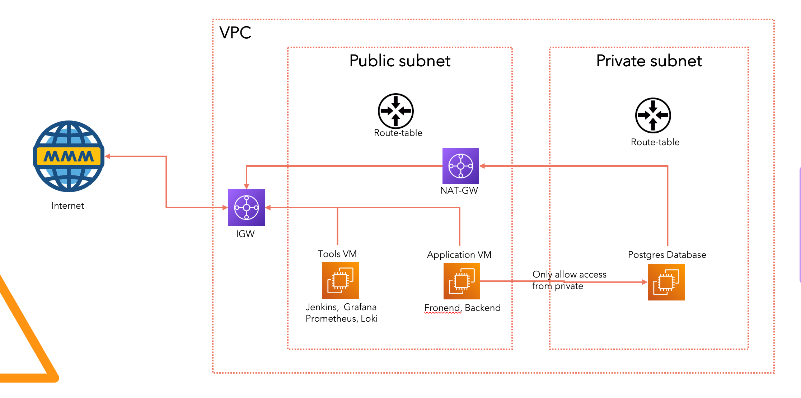
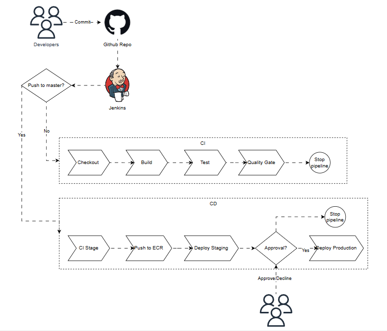

# 🎓 DevOps Capstone Project: 3-Tier Application Deployment and Observability

## Information for Students:
- This is where it all comes together! This project contains all the concepts we've learned so far.
- This project is designed to help you practice the theoretical concepts from this course.
- Please begin by forking and cloning the repository to your GitHub account.
- **Note:** The application code and infrastructure (Dockerfile/Compose) contain intentional imperfections. This is a learning experience designed to help you practice troubleshooting and debugging. Let's start with what we have and improve it step-by-step!
- Good luck, and see you at the last lesson! 🏁

## 1. Project Brief & Core Objectives

### Project Title
**Automated 3-Tier Application Deployment and Observability on Pre-Provisioned AWS Infrastructure with Jenkins and the Prometheus-Loki Stack**

### Project Goal
To implement a robust, automated Continuous Integration/Continuous Delivery (CI/CD) pipeline and a comprehensive monitoring solution for a containerized 3-tier To-Do list application, leveraging a pre-configured AWS environment and a professional open-source DevOps toolchain.

### Core Objectives
1. **Containerization:** Define and build production-ready **Docker images** for the application components.
2. **CI/CD Implementation:** Build a complete **Jenkins Pipeline-as-Code** that enforces separate deployment strategies for non-production (dev) and production environments, triggered by both **Push** and **Pull Request**. 

3. **Multi-Environment Deployment:** Deploy the application to a **Docker on EC2** environment for dev and a **Kubernetes (Kind https://kind.sigs.k8s.io/)** cluster for production.
4. **Security:** Implement best practices for managing **PostgreSQL credentials** securely across all environments.
5. **Observability:** Implement a full monitoring and logging stack using **Prometheus, Grafana, and Loki** to ensure the health and performance of the application and infrastructure. 

## 2. Application and Infrastructure Details

### 2.1. Application Components (The To-Do List App) 💻

The student must containerize and configure the following components, ensuring connectivity to the PostgreSQL database.

| Layer | Repository | Technology | Requirement | 
| ----- | ----- | ----- | ----- | 
| **Frontend** | `https://github.com/devopsway/devops-bootcamp-todolist-frontend` | Node.js / React | Create a minimal, multi-stage **Dockerfile**. | 
| **Backend API** | `https://github.com/devopsway/devops-bootcamp-todolist-backend-api` | Node.js / Express | Create a minimal, multi-stage **Dockerfile**. Configure to accept DB connection details via environment variables. | 
| **Database** | **PostgreSQL (AWS RDS)** | PostgreSQL | Connection details must be **sourced securely** by the Backend API deployments. | 

### 2.2. AWS Infrastructure Assumptions (Pre-Provisioned) ☁️

The student should assume the following resources are already provisioned and operational in AWS. This project focuses on the software delivery pipeline, not Infrastructure as Code (IaC).

* **Jenkins Host:** A dedicated **AWS EC2 instance** running **Jenkins**, pre-configured with **Docker**, AWS CLI, and necessary credentials for the build agent. This server acts as the **Non-Production (dev) deployment host**.
* **Image Registry:** Two operational **AWS Elastic Container Registry (ECR)** repositories (one for Frontend, one for Backend).
* **Production Cluster:** An operational **AWS Kind https://kind.sigs.k8s.io/ (Elastic Kubernetes Service) cluster** with networking and worker nodes set up.
* **Database:** An operational **AWS RDS instance running PostgreSQL**.

## 3. CI/CD Pipeline Requirements (Jenkins) 🚀

The entire pipeline must be defined using a dynamic **Jenkins Pipeline-as-Code** (Jenkinsfile) that adapts its execution based on the Git trigger.

### 3.1. Continuous Integration (CI) Workflow

**Trigger:** **Pull Request (PR) Opened/Updated** against the main branch.

| Stage | Action | Goal | Restriction | 
| ----- | ----- | ----- | ----- | 
| **1. Source** | Checkout code from the PR branch. | Prepare workspace. | N/A | 
| **2. Build** | Build Docker images for both Frontend and Backend. | Ensure successful container build. | N/A | 
| **3. Testing** | Run unit and integration tests (using application's native test runners). | Verify application logic and stability. | N/A | 
| **4. Quality Gate** | Run code quality checks (e.g., Linters) and ensure all tests pass. | Validate code quality before merge. | **Pipeline MUST STOP HERE.** | 
| **Result:** | **Report status (Success/Failure) back to GitHub to gate the merge.** | N/A | N/A | 

### 3.2. Continuous Delivery (CD) Workflow

**Trigger:** **Push to Main Branch** (or designated deployment branch).

| Stage | Action | Target Environment | Security & Tools | 
| ----- | ----- | ----- | ----- | 
| **1-4. CI Stages** | Re-run Source, Build, Testing, and Quality Gate. | N/A | Must succeed before proceeding. | 
| **5. Push** | Authenticate with ECR and push the successfully tested Docker images (using commit SHA or version as tag). | AWS ECR | Docker, AWS ECR | 
| **6. Deploy (Non-Prod/dev)** | Pull images from ECR and deploy the containers to the **EC2 Non-Prod Host**. | AWS EC2 (dev) | **Docker Compose**. PostgreSQL credentials (host, user, password) must be retrieved from **Jenkins Credentials** and injected as environment variables into the Backend container. | 
| **7. Approval Gate** | Implement a **manual input step** in the Jenkinsfile. | N/A | Jenkins Input | 
| **8. Deploy (Prod)** | Deploy the containers to the **Kind https://kind.sigs.k8s.io/ Kubernetes Cluster**. | AWS Kind https://kind.sigs.k8s.io/ (Production) | **Kubernetes Manifests (YAML)**. PostgreSQL credentials must be stored securely as a **Kubernetes Secret** and referenced by the Backend Deployment. | 

## 4. Monitoring & Observability Requirements 👁️

A unified observability stack must be deployed, connected, and configured to monitor the health of the application and the deployment environments.

### 4.1. Metrics Collection (Prometheus)

* **Deployment:** Deploy **Prometheus** (recommended on the Kind https://kind.sigs.k8s.io/ cluster).

* **Scraping Targets:** Configure Prometheus to scrape metrics from:

  * **Kind https://kind.sigs.k8s.io/ Cluster Health:** Worker nodes, Pods, Deployments (via standard Kind https://kind.sigs.k8s.io/ exporters).

  * **EC2 dev Host:** Resource utilization (CPU, Memory, Disk) via **Node Exporter**.

  * **Backend API:** Application-level performance indicators (request count, latency, error rates—requires simple instrumentation/exporter).

### 4.2. Log Aggregation (Loki)

* **Loki Deployment:** Deploy **Loki** alongside Prometheus.

* **Promtail Agents:** Deploy **Promtail** as a log shipper on:

  * The **Non-Prod EC2 instance** to ship Docker container logs.

  * All **Kind https://kind.sigs.k8s.io/ worker nodes** to ship container logs to Loki.

### 4.3. Visualization and Dashboards (Grafana)

* **Deployment:** Deploy **Grafana**.

* **Data Sources:** Configure Grafana to use both **Prometheus** and **Loki** as data sources.

* **Dashboards:** Create a minimum of two custom dashboards:

  * **Infrastructure Dashboard:** Showing Kind https://kind.sigs.k8s.io/ resource usage and EC2 health.

  * **Application Dashboard:** Showing API performance metrics (Latency, Error Rate, Throughput) alongside a **Loki Logs Panel** configured for **logs correlation** (filtering logs by time range and labels based on metric data).

## 5. Deliverables and Documentation 📝

The student must submit a comprehensive final package including:

1. **CI/CD Code:** The complete, functional **Jenkinsfile**.

2. **Containerization Artifacts:** Final **Dockerfiles** for Frontend and Backend.

3. **Deployment Scripts:**

   * **Docker Compose** configuration (`docker-compose.yml`) for dev.

   * **Kubernetes Manifests (YAML)** for Production (Deployment, Service, Ingress, and Secret).

4. **Monitoring Configuration:** Configuration files for Prometheus, Loki, and exported Grafana dashboards (JSON).

5. **Final Report/ReadMe:** A detailed document that includes:

   * An architectural diagram of the implemented solution.

   * An explanation of the security practices used for managing PostgreSQL credentials.

   * Verification steps to confirm all CI/CD stages and monitoring dashboards are working correctly.
6. **Prepare presentation slide**: Student will present about the solution on the last lesson