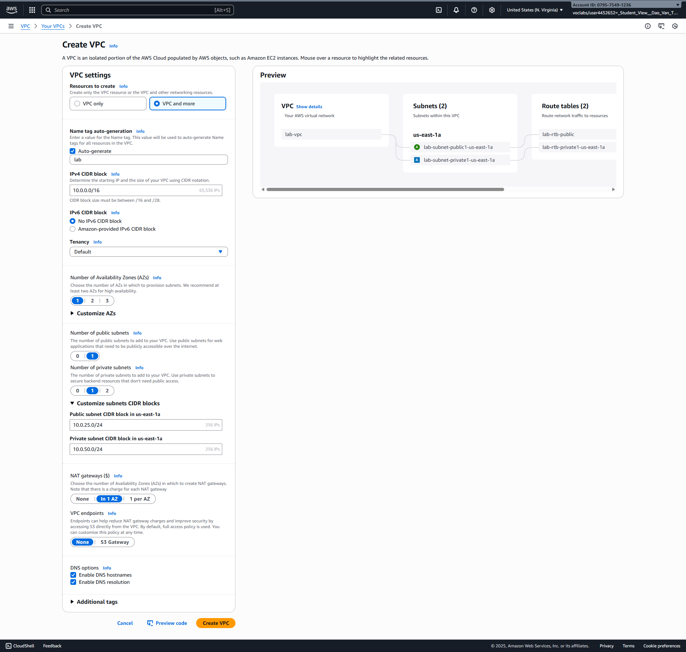
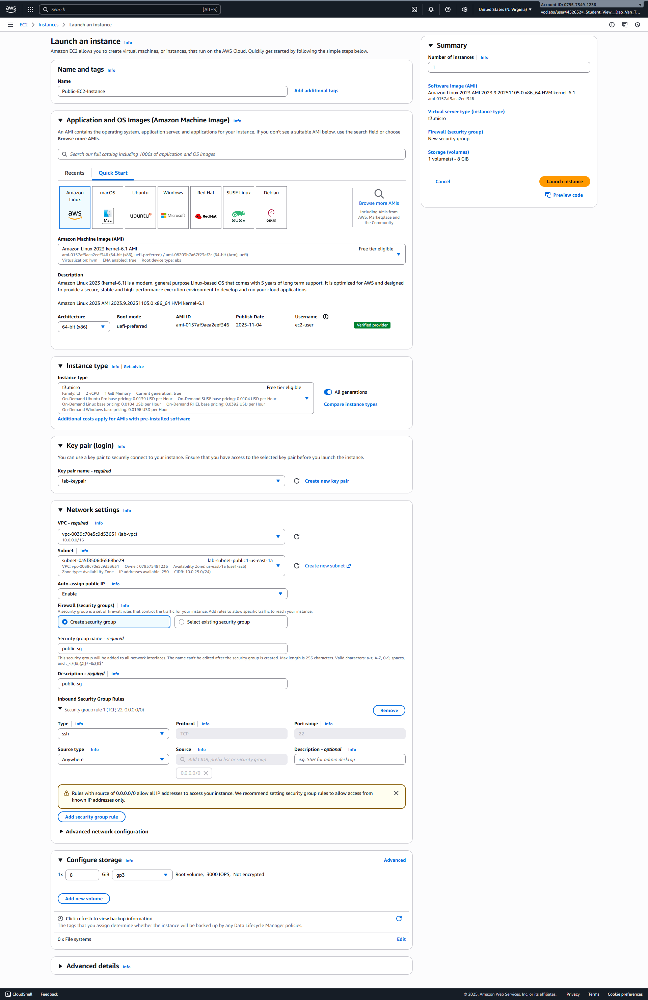
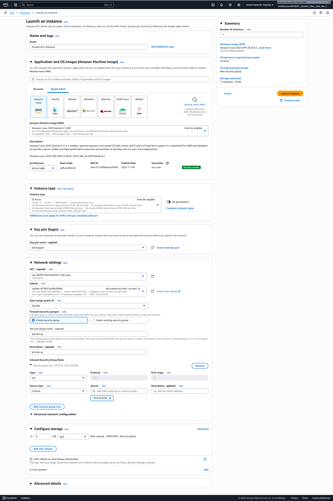

# Practice Lab - Lesson 9: AWS Fundamentals & Core Services

# Introduction to Amazon Virtual Private Cloud (VPC)

## Lab overview

This lab introduces you to Amazon Virtual Private Cloud (Amazon VPC). In this lab you use the Amazon VPC wizard to create a VPC, attach an Internet gateway, add a subnet and then define routing for the VPC so that traffic can flow between the subnet and the Internet gateway.

## Objectives

By the end of this lab, you should be able to do the following:

- Create an Amazon VPC Using the VPC Wizard
- Explore the basic components of a VPC including:
  - Public and private subnets
  - Route tables and routes
  - NAT gateways
  - Network ACLs

### Services used in this lab

#### Amazon Virtual Private Cloud (VPC)

Amazon Virtual Private Cloud (Amazon VPC) lets you provision a logically isolated section of the Amazon Web Services (AWS) cloud where you can launch AWS resources in a virtual network that you define. You have complete control over your virtual networking environment, including selection of your own IP address range, creation of subnets, and configuration of route tables and network gateways. You can use both IPv4 and IPv6 in your VPC for secure and easy access to resources and applications.

---

## Task 1: Create an Amazon VPC

In this task you create an Amazon VPC using the *VPC wizard*. The wizard automatically creates a VPC based upon parameters you specify. Using the VPC Wizard is much simpler than manually creating each component of the VPC.

Here is an overview of the VPC you create:


*Image description: The preceding diagram depicts an Amazon Virtual Private Cloud (VPC) consisting of a public subnet and a private subnet. An internet gateway is attached to the Amazon VPC, and a Network Address Translation (NAT) gateway is launched in the public subnet.*

Each component is explained in more detail later in this lab.

1. At the top of the AWS Management Console, in the search bar, search for and choose **VPC**.

2. Choose **Create VPC**.

3. On **Create VPC** page, under **VPC settings** section:

   - Choose **VPC and more** (the second option).

     📝 **Note:** You are now presented with parameters to customize the VPC configuration.

   - For Name tag auto-generation, select Auto-generate and enter `Lab` in the text box.

   - For **Number of Availability Zones (AZs)**, choose **1**.

   - For **Number of public subnets**, choose **1**.

   - For **Number of private subnets**, choose **1**.

   - Expand **Customize subnets CIDR blocks** and then:
     - For **Public subnet CIDR block in eu-west-2a**, enter `10.0.25.0/24`.
     - For **Private subnet CIDR block in eu-west-2a**, enter `10.0.50.0/24`.

   - For **NAT gateways ($)**, choose **In 1 AZ**.

   - For **VPC endpoints**, choose **None**.

4. Choose **Create VPC**.

   Your VPC is now created. A status window displays progress. When the VPC completes, a status window confirms that your VPC has been successfully created. This may take a few minutes to create.

5. Choose **View VPC**.



👍 **Task complete:** You have successfully created an Amazon VPC using the *VPC wizard*.

## Task 2: Explore your VPC

In this task, you explore the VPC components created by the VPC Wizard.

6. In the left navigation pane, under **Virtual private cloud**, choose **Your VPCs**.

7. Locate Your VPCs's **Name** column, your VPC is created with the name **lab-vpc**.

8. In the left navigation pane, under **Virtual private cloud**, choose **Internet gateways**.

    The Internet gateway for your VPC is displayed.

9. In the left navigation pane, under **Virtual private cloud**, choose **Subnets**.

10. Select the **Public subnet** which starts with **Lab-subnet-public** in the **Name** column.

11. Examine the information displayed in the lower window pane:

    - Each subnet is assigned a unique **Subnet ID**.
    - The **IPv4 CIDR** of *10.0.25.0/24* means that the subnet contains the range of IP addresses from *10.0.25.0* to *10.0.25.255*. (IPv6 is also supported, but is not part of this lab.)
    - The subnet only has 250 **Available IPs** out of 256 possible addresses. This is because there are several reserved addresses in each subnet and one IP address has been consumed by the NAT gateway.

    💬 **Consider:** Why is this subnet considered to be a *Public* subnet? The answer lies in the Subnet *Routing*.

12. Choose the **Route table** tab.

    ℹ️ **Learn more:** Each subnet is associated with a **Route table**, which specifies the routes for outbound traffic leaving the subnet. Think of it like an address book that lists where to direct traffic based upon its destination.

    

    *Image description: The preceding diagram depicts that the route table associated with the public subnet contains two routes. The first route is the local route (destination: 10.0.0.0/16), which allows communication within the Virtual Private Cloud (VPC) for the specified CIDR range. Traffic destined for this local route never leaves the VPC. The second route is the default route (destination: 0.0.0.0/0), which directs all IPv4 traffic destined for the internet to the Internet Gateway (IGW).*

    ℹ️ **Learn more:** Routing rules are evaluated from the most restrictive (with the bigger number after the slash) through to the least restrictive (which is *0.0.0.0/0* since it refers to the entire Internet). Thus, traffic is first sent within the VPC if it falls within the range of the VPC, otherwise it is send to the Internet. The rules can further be edited based upon your particular network configuration.

    📝 **Note:** This subnet is associated with a Route Table that has a route to an internet gateway which makes it a *Public Subnet*. This makes it reachable from the internet.

13. Choose the **Network ACL** tab.

    

    *Image description: The preceding diagram depicts a Network Access Control List (ACL), which is an optional security layer for a Virtual Private Cloud (VPC) in AWS. It acts as a stateless firewall, controlling traffic in and out of subnets. The Network ACL is initially configured with default settings that allow all inbound and outbound traffic.*

    The following list details the rules in the diagram:

    - *Rule 100 Inbound* allows all inbound traffic from any source to the public subnet.
    - *Rule 100 Outbound* allows all outbound traffic from the public subnet to any destination.
    - The second line in each ruleset is represented by an asterisk (*), which acts as a catch-all rule. If the incoming or outgoing traffic does not match any of the earlier rules in the Network ACL, this catch-all rule ensures that the traffic is denied by default, providing an additional layer of security.

14. In the left navigation pane, under **Virtual private cloud**, choose **Subnets**.

15. Select the **Private subnet** which starts with **Lab-subnet-private** in the **Name** column and ensure that it is the only line selected.

16. Choose the **Tags** tab.

    📝 **Note:** The subnet has been tagged with the key of **Name** starting with the value of **Lab-subnet-private**. Tags help you to manage and identify your AWS resources.

17. Choose the **Route table** tab.

    

    *Image description: The preceding diagram depicts the route table configuration for the private subnet within the Virtual Private Cloud (VPC).*

    The route table contains the following two routes:

    - *Route 10.0.0.0/16 | local* is identical to the one in the public subnet's route table. It allows communication within the VPC for the specified CIDR range (10.0.0.0/16). Traffic destined for this local route never leaves the VPC.

    - *Route 0.0.0.0/0 | nat-* is the default route, directing all IPv4 traffic destined for the internet to the Network Address Translation (NAT) gateway. The NAT gateway is an AWS-managed service that enables instances in the private subnet to connect to the internet or other AWS services, but prevents the internet from initiating connections to those instances.

    📝 **Note:** The route table for the private subnet does not include a route to the Internet Gateway (IGW). This absence of a direct internet route is what defines this subnet as a *private subnet*. Instances in this private subnet cannot be directly accessed from the internet, providing an additional layer of security and isolation.

18. In the left navigation pane, under **Virtual private cloud**, choose **NAT gateways**.

    A NAT gateway is displayed.

    

    *Image description: The preceding diagram depicts the resource within the private subnet initiates an outbound connection to the internet. The traffic from the private subnet is routed to the NAT gateway, as specified in the private subnet's route table. The NAT gateway then forwards the traffic to the Internet Gateway, acting as an intermediary for the communication.*

    📝 **Note:** A Network Address Translation (NAT) gateway allows resources in a private subnet to connect to the Internet and other resources outside the VPC. This is an *outbound-only* connection, which means that the connection must be initiated from within the private subnet. Resources on the Internet cannot initiate an inbound connection. Therefore, it is a means of keeping resources private and improving security for VPC resources.

19. In the left navigation pane, under **Security**, choose **Security groups**.


👍 **Task complete:** You have successfully explored the VPC components created by the *VPC Wizard*.

## Task 3: Create EC2 Instances

In this task, you will create two EC2 instances - one in the public subnet and one in the private subnet to demonstrate the difference between public and private subnet connectivity.

20. In the left navigation pane, under **Compute**, choose **EC2** or search for **EC2** in the search bar and select it.

21. Choose **Launch instance**.

22. Configure the first EC2 instance (Public Subnet):

    - For **Name**, enter `Public-EC2-Instance`.
    
    - For **Application and OS Images (Amazon Machine Image)**, choose **Amazon Linux 2023 AMI** (keep the default selection).
    
    - For **Instance type**, choose **t3.micro** (eligible for free tier).
    
    - For **Key pair (login)**, choose **Create new key pair**:
      - Name: `lab-keypair`
      - Key pair type: **RSA**
      - Private key file format: **.pem**
      - Choose **Create key pair** and save the file to your computer.
    
    - For **Network settings**, choose **Edit**:
      - VPC: Select your **lab-vpc**
      - Subnet: Select the **public subnet** (Lab-subnet-public)
      - Auto-assign public IP: **Enable** (this is important for internet access)
      - Firewall (security groups): **Create security group**
        - Security group name: `public-sg`
        - Description: `Security group for public EC2 instance`
        - Add rule: Type **SSH**, Source **Any Where**
    
    - Leave other settings as default and choose **Launch instance**.
    
23. Choose **Launch instance** again to create the second instance.

24. Configure the second EC2 instance (Private Subnet):

    - For **Name**, enter `Private-EC2-Instance`.
    
    - For **Application and OS Images (Amazon Machine Image)**, choose **Amazon Linux 2023 AMI** (keep the default selection).
    
    - For **Instance type**, choose **t3.micro** (eligible for free tier).
    
    - For **Key pair (login)**, select the existing **lab-keypair** you created.
    
    - For **Network settings**, choose **Edit**:
      - VPC: Select your **lab-vpc**
      - Subnet: Select the **private subnet** (Lab-subnet-private)
      - Auto-assign public IP: **Disable**
      - Firewall (security groups): **Create security group**
        - Security group name: `private-sg`
        - Description: `Security group for private EC2 instance`
        - Add rule: Type **SSH**, Source **Custom**, enter the CIDR of your public subnet: `10.0.25.0/24`
    
    - Leave other settings as default and choose **Launch instance**.
    
25. Navigate to **Instances** in the EC2 dashboard to view your created instances.

26. Wait for both instances to reach the **Running** state (this may take a few minutes).

27. Select the **Public-EC2-Instance** and note:
    - It has both a **Private IPv4 address** (e.g., 10.0.25.x)
    - It has a **Public IPv4 address** (accessible from the internet)

28. Select the **Private-EC2-Instance** and note:
    - It only has a **Private IPv4 address** (e.g., 10.0.50.x)
    - It has **no Public IPv4 address** (not directly accessible from the internet)

    📝 **Note:** The public EC2 instance can be accessed directly from the internet via SSH, while the private EC2 instance can only be accessed from within the VPC or through the public instance (bastion host pattern).

👍 **Task complete:** You have successfully created EC2 instances in both public and private subnets.

## Task 4: Test SSH Connectivity

In this task, you will test SSH connectivity to both instances to understand how public and private subnets work in practice. You'll connect to the public instance directly from the internet, then use it as a "bastion host" to connect to the private instance.

29. First, test SSH connection to the **Public EC2 Instance**:

    - In the EC2 dashboard, select your **Public-EC2-Instance**.
    
    - Copy the **Public IPv4 address** (e.g., 54.xxx.xxx.xxx).
    
    - Open your terminal/command prompt on your local computer.
    
    - Navigate to the directory where you saved the `lab-keypair.pem` file.
    
    - Change the permissions of your key file (Linux/Mac):
      ```bash
      chmod 400 lab-keypair.pem
      ```
      
    - For Windows (PowerShell), ensure the key file has restricted permissions.
    
    - SSH to the public instance:
      ```bash
      ssh -i lab-keypair.pem ec2-user@[PUBLIC_IP_ADDRESS]
      ```
      Replace `[PUBLIC_IP_ADDRESS]` with the actual public IP you copied.
    
    - Type `yes` when prompted to accept the fingerprint.
    
    - You should successfully connect to the public EC2 instance!

30. Test connectivity **from the public instance to the private instance**:

    - **Method 1: Copy and paste the key content (Recommended)**
    
      On your local computer, display the key content:
      ```bash
      cat lab-keypair.pem
      ```
      Copy the entire output (including the BEGIN and END lines).
      
      On the public EC2 instance, create the key file:
      ```bash
      nano lab-keypair.pem
      ```
      Paste the key content and save (Ctrl+X, then Y, then Enter).
      
    - **Method 2: Use SCP to transfer the file (Alternative)**
    
      From your local computer, copy the PEM file to the public instance:
      ```bash
      scp -i lab-keypair.pem lab-keypair.pem ec2-user@[PUBLIC_IP_ADDRESS]:~/
      ```
      Replace `[PUBLIC_IP_ADDRESS]` with your public instance IP.
      
    - Set proper permissions on the public EC2 instance:
      ```bash
      chmod 400 lab-keypair.pem
      ```
      
    - Verify the key file exists:
      ```bash
      ls -la lab-keypair.pem
      ```
      You should see permissions like `-r--------`

31. From the public EC2 instance, SSH to the private instance:

    - In the EC2 dashboard, select your **Private-EC2-Instance** and copy its **Private IPv4 address** (e.g., 10.0.50.xxx).
    
    - From the public EC2 instance terminal, SSH to the private instance:
      ```bash
      ssh -i lab-keypair.pem ec2-user@[PRIVATE_IP_ADDRESS]
      ```
      Replace `[PRIVATE_IP_ADDRESS]` with the private IP you copied.
    
    - You should successfully connect to the private EC2 instance!

32. Test internet connectivity from both instances:

    - From the **public instance**, test internet access:
      ```bash
      ping -c 4 google.com
      curl -I https://aws.amazon.com
      ```
      This should work successfully.
    
    - From the **private instance**, test internet access:
      ```bash
      ping -c 4 google.com
      curl -I https://aws.amazon.com
      ```
      This should also work (through the NAT Gateway).

33. Verify the network architecture:

    - Note that:
      - **Public Instance**: Accessible directly from the internet, can access the internet directly
      - **Private Instance**: NOT accessible directly from the internet, but can access the internet through NAT Gateway
      - **Bastion Pattern**: Public instance serves as a "jump box" to access private resources

    📝 **Note:** This demonstrates the classic "bastion host" pattern where the public instance acts as a secure gateway to access private resources. In production, you would typically use AWS Systems Manager Session Manager or AWS Bastion Host services for enhanced security.

👍 **Task complete:** You have successfully tested SSH connectivity and demonstrated the public/private subnet architecture.

---

## Conclusion

You successfully did the following:

- Created an Amazon VPC Using the **VPC Wizard**.
- Explored the basic components of a VPC.
- Created and tested EC2 instances in both public and private subnets.

## End lab

Follow these steps to close the console and end your lab.

34. Return to the **AWS Management Console**.

35. Remove EC2, Nat Gateway, VPC (VPC won't cost any money, we can keep it, but EC2 and Nat Gateway cost money, should be removed after lab is done)